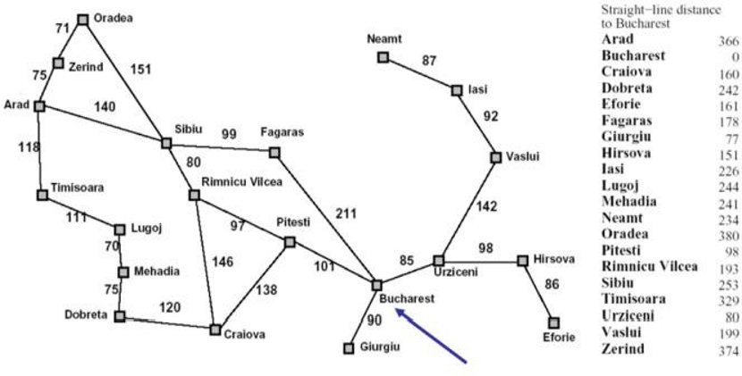

# Intelligent Route Planning

A Python implementation of classical search algorithms for finding routes in the Romania map problem.

The project compares how different search strategies find a path from Arad to Bucharest using a weighted city graph and heuristic values.

## Romania Map



## Algorithms Implemented

- Breadth-First Search (BFS)
- Greedy Best-First Search
- A* Search

## Results

Starting city: **Arad**  
Goal city: **Bucharest**

| Algorithm | Route Distance |
| --- | --- |
| BFS | 450 km |
| Greedy Best-First Search | 450 km |
| A* Search | 418 km |

A* Search found the lowest-cost route by combining the path cost with heuristic values.

## Tech Stack

- Python
- `collections.deque`
- `queue.PriorityQueue`

## Author

**Shaima Nabeel Albokhari**  
Computer Science Graduate | Data & AI


```bash
python route_search.py
